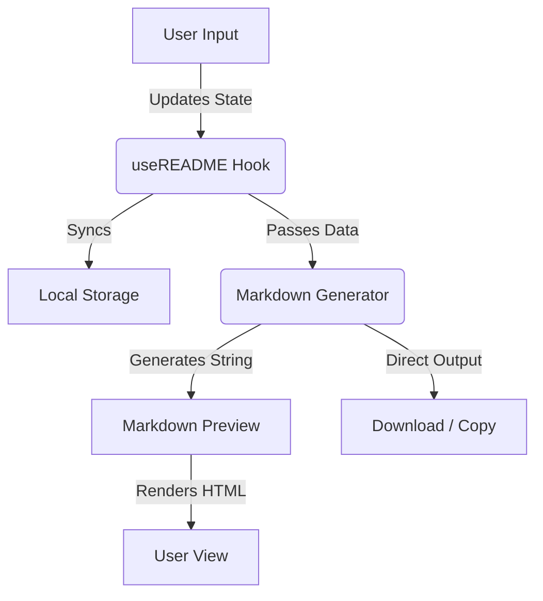

# <p align="center"><br>ReadmeSmith</p>

<p align="center">
  
  
  
  
</p>

---

## 🚀 Overview

**ReadmeSmith** is a modern, professional, and highly customizable GitHub README generator. Built with a focus on aesthetics and ease of use, it allows developers to forge beautiful profile pages using a modular, "SaaS-style" interface.

### ✨ Key Features
- **Modular Sections:** Add, remove, and reorder sections like Banners, Stats, Skills, and more.
- **Sustainable Socials:** High-quality, coloured brand icons powered by `coloured-icons`.
- **Live Preview:** Real-time markdown rendering as you edit.
- **Interactive Snake:** Integrated GitHub Contribution Snake animation preview.
- **GIF Support:** Easily add and align custom animations.
- **Mobile Responsive:** Full-featured editor and preview on any device.

---

## 🛠 Architecture & Workflow

ReadmeSmith follows a clean, component-based architecture leveraging the power of Next.js and React's state management.

### 🔄 System Flow



### 📂 Directory Structure

- `src/app`: Core pages and global layout configurations.
- `src/components`: UI primitives and feature-specific components (Editor, Preview, Contributors).
- `src/hooks`: Custom state logic for README data management.
- `src/lib`: The engine of the app, including the `markdown-generator`.
- `src/types`: TypeScript definitions for project-wide consistency.

---

## 🎨 Social Styles

ReadmeSmith supports two distinct styles for your "Connect with me" section:

| Style | Preview |
|-------|---------|
| **Sustainable** | Colorful, official brand logos with a modern look. |
| **Badges** | Classic, high-contrast Shields.io badges. |

---

## 📦 Getting Started

1. **Clone the repo**
   ```bash
   git clone https://github.com/your-username/readmesmith.git
   ```
2. **Install dependencies**
   ```bash
   npm install
   ```
3. **Run the development server**
   ```bash
   npm run dev
   ```

---

## 💖 Support the Project

If you find **ReadmeSmith** useful and want to support its development, consider buying me a coffee!

<p align="left">
  <a href="https://paypal.me/SujoyMoulick?locale.x=en_GB&country.x=IN" target="_blank">
    
  </a>
</p>

---

## 📜 Credits

ReadmeSmith is built upon the amazing work of the open-source community. Check our **Contributors** page in the app for a full list of projects that make this possible.

---

<p align="center">Made with ❤️ for the Developer Community</p>
